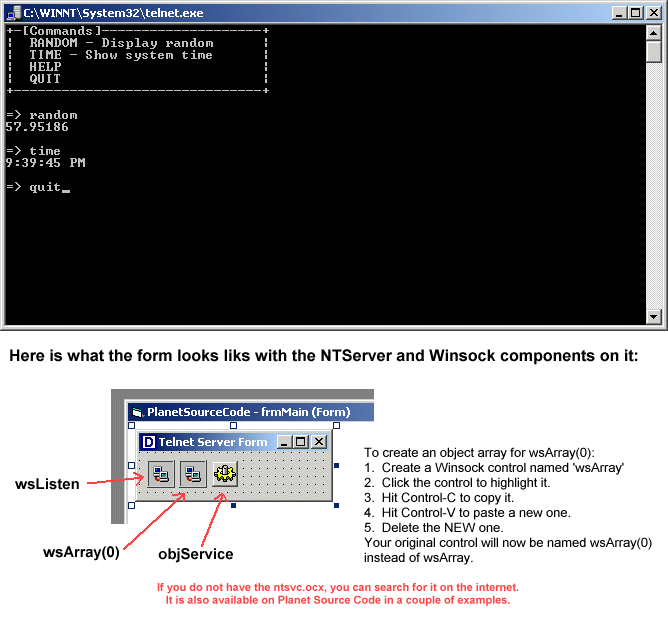

<div align="center">

## Multiple\-Connection Telnet Server \(run as a service\)


</div>

### Description

Put it all together - this program was compiled from a number of different articles on this service as well as a little modification of my own. It allows you to create a telnet server service to run commands or return data on your servers. Runs as a Windows NT/2000 service on Port 26 (by default) and even allows multiple users to be connected at once.
 
### More Info
 
To use this code, you must HAVE these components:

1. Microsoft NT Service Control (ntsvc.ocx)

2. Microsoft Winsock Control 6.0 (SP4) (mswinsck.ocx)

To use this code, you must DO the following:

1. Create a single, main form

2. Add two WINSOCK controls, one called 'wsListen' and

another WINSOCK component array called 'wsArray(0)'

In other words, you should have two WINSOCK compon-

ents on your form.

3. Create one NTService object on the main form called

'objService'.

4. Copy the following code to your form

- After coding, compile the program

- Run from the Command Prompt:

programname.exe -install

- Run from the Command Prompt:

net start telnetd

If you did everything right, you should be able to

telnet to your computer!

USAGE: State -> Run -> telnet localhost 26


<span>             |<span>
---                |---
**Submitted On**   |
**By**             |[Daniel M\. Hendricks](https://github.com/Planet-Source-Code/PSCIndex/blob/master/ByAuthor/daniel-m-hendricks.md)
**Level**          |Intermediate
**User Rating**    |4.8 (24 globes from 5 users)
**Compatibility**  |VB 6\.0
**Category**       |[Complete Applications](https://github.com/Planet-Source-Code/PSCIndex/blob/master/ByCategory/complete-applications__1-27.md)
**World**          |[Visual Basic](https://github.com/Planet-Source-Code/PSCIndex/blob/master/ByWorld/visual-basic.md)
**Archive File**   |[](https://github.com/Planet-Source-Code/daniel-m-hendricks-multiple-connection-telnet-server-run-as-a-service__1-21382/archive/master.zip)

### API Declarations

Public strCommand As String


### Source Code

```
Public strCommand As String
Private Sub Form_Load()
 'BE SURE TO READ THE "ASSUMES" SECTION ABOVE FIRST!
 objService.DisplayName = "Telnet Server Demo"
 objService.ServiceName = "telnetd"
 wsListen.LocalPort = 26
 'This code is displayed if the user runs the program from
 'the command-line.
 If Trim$(Command$) <> "" Then
 Select Case UCase$(Trim$(Command$))
 Case "-INSTALL"
 If objService.Install Then
 MsgBox "Result: " & App.Title & " successfully installed as a Windows NT Service." & vbCrLf & "Service Name: " & objService.ServiceName, vbInformation, "Install Complete, Please Re-Start Application"
 Else
 MsgBox "Result: " & App.Title & " FAILED to installed as a Windows NT Service." & vbCrLf & "Service Name: " & objService.ServiceName & vbCrLf & vbCrLf & "Solutions: Check to see if the service is allready installed. If so, run " & App.EXEName & " -uninstall to remove it.", vbInformation, "Install Failed, Please Re-Start Application"
 End If
 End
 Case "-UNINSTALL"
 If objService.Uninstall Then
 MsgBox "Result: " & App.Title & " successfully uninstalled as a Windows NT Service." & vbCrLf & "Removed Service Name: " & objService.ServiceName, vbInformation, "UnInstall Complete, Please Re-Start Application"
 Else
 MsgBox "Result: " & App.Title & " FAILED to Uninstalled as a Windows NT Service." & vbCrLf & "Service Name: " & objService.ServiceName & vbCrLf & vbCrLf & "Solutions: Check to see if the service is installed. If not, run " & App.EXEName & " -install to install it.", vbInformation, "UnInstall Failed, Please Re-Start Application"
 End If
 End
 Case Else
 MsgBox "Valid Syntax: " & vbCrLf & vbCrLf & "-install To Install " & App.Title & " as a WinNT Service" & vbCrLf & vbCrLf & "-uninstall To UN-INSTALL " & App.Title & " from the WinNT Service List", vbInformation, "Invalid Syntax: Aborting Program Launch"
 End Select
 End If
 objService.ControlsAccepted = svcCtrlPauseContinue
 objService.StartService
 Me.Hide
End Sub
Private Sub objService_Start(Success As Boolean)
 'This code is executed when the service is started
 On Error GoTo ErrHandler
 Success = True
 wsListen.Listen
 Exit Sub
ErrHandler:
 'If service fails, write an event to the system log.
 Call objService.LogEvent(svcMessageError, svcEventError, "[" & _
 Err.Number & "] " & Err.Description)
 Resume Next
End Sub
Private Sub wsArray_DataArrival(Index As Integer, ByVal bytesTotal As Long)
 'This code determinds what to do based on user input
 Dim strData(100) As String
 On Error GoTo ErrorHandler
 'Get the current character user typed
 wsArray(Index).GetData strData(Index), vbString, bytesTotal
 If strData(Index) = vbCrLf Or strData(Index) = vbCr Then
 Select Case UCase(wsArray(Index).Tag)
 Case "RANDOM"
 'Display a random number
 wsArray(Index).SendData vbCrLf & Rnd(1) * 100 & vbCrLf
 Case "TIME"
 'Display the current time
 wsArray(Index).SendData vbCrLf & Time() & vbCrLf
 Case "HELP"
 wsArray(Index).SendData vbCrLf
 Call ShowMenu(Index)
 Case "QUIT"
 wsArray(Index).Tag = ""
 wsArray(Index).Close
 Exit Sub
 End Select
 wsArray(Index).Tag = ""
 wsArray(Index).SendData vbCrLf & "=> "
 ElseIf Asc(strData(Index)) = 8 Then 'Backspace was pressed
 If Not wsArray(Index).Tag = "" Then
 'Remove one character from current input
 wsArray(Index).Tag = Left(wsArray(Index).Tag, Len(wsArray(Index).Tag) - 1)
 'Move the cursor back one space
 wsArray(Index).SendData Chr(8) & " " & Chr(8)
 End If
 Else
 'This represents the current command. The current command is
 'each character the user types in until the user presses the
 'enter key.
 wsArray(Index).Tag = wsArray(Index).Tag & strData(Index)
 'This ECHOs the character back to the user
 wsArray(Index).SendData strData(Index)
 End If
 Exit Sub
ErrorHandler:
 'Display an error if one occurs
 Dim ErrDesc As String
 wsArray(Index).SendData vbCrLf & Err.Description & vbCrLf
 wsArray(Index).SendData vbCrLf & "=> "
 wsArray(Index).Tag = ""
End Sub
Private Sub wsListen_ConnectionRequest(ByVal requestID As Long)
 'This listens for a connection and finds an open socket
 Dim Index As Integer
 Index = FindOpenWinsock
 wsArray(Index).Accept requestID
 Call ShowMenu(Index)
 wsArray(Index).SendData "=> "
End Sub
Private Sub ShowMenu(Index As Integer)
 'This sends the menu. We used (Index) in every instance of
 'socket array because we want the data send to the appropriate
 'user, in case more than one person is connected.
 wsArray(Index).SendData "+-[Commands]--------------------+" & vbCrLf
 wsArray(Index).SendData "| RANDOM - Display random |" & vbCrLf
 wsArray(Index).SendData "| TIME - Show system time |" & vbCrLf
 wsArray(Index).SendData "| HELP |" & vbCrLf
 wsArray(Index).SendData "| QUIT |" & vbCrLf
 wsArray(Index).SendData "+-------------------------------+" & vbCrLf & vbCrLf
End Sub
Private Function FindOpenWinsock()
 'This function finds the next open socket, allowing your program
 'to accept more than one connection
 Static LocalPorts As Integer
 'Find open socket
 For X = 0 To wsArray.UBound
 If wsArray(X).State = 0 Then
 FindOpenWinsock = X
 Exit Function
 End If
 Next X
 'None are open so let's make one
 Load wsArray(wsArray.UBound + 1)
 'Let's make sure we don't get conflicting local ports
 LocalPorts = LocalPorts + 1
 wsArray(wsArray.UBound).LocalPort = wsArray(wsArray.UBound).LocalPort + LocalPorts
 FindOpenWinsock = wsArray.UBound
End Function
```

